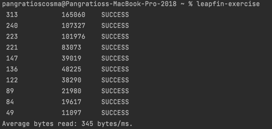

# Leapfin Interview Exercise

### Todo:

- [ ] publish cli app
- [ ] run in ts-node and node
- [ ] write installation instructions

## The Exercise:

Write a program in a language of your choice that spawns 10 workers (threads, processes, actors, whatever), where each worker simultaneously searches a stream of random (or pseudo-random) data for the string 'Lpfn', then informs the parent of the following data fields via some form of inter-process communication or shared data structure:
* elapsed time
* count of bytes read
* status

The parent collects the results of each worker (confined to a timeout, explained below) and writes a report to stdout for each worker sorted in descending order by [elapsed]:
[elapsed] [byte_cnt] [status]

Where [elapsed] is the elapsed time for that worker in ms, [byte_cnt] is the number of random bytes read to find the target string and [status] should be one of {SUCCESS, TIMEOUT, FAILURE}. FAILURE should be reported for any error/exception of the worker and the specific error messages should go to stderr. TIMEOUT is reported if that worker exceeds a given time limit, where the program should support a command-line option for the timeout value that defaults to 60s. If the status is not SUCCESS, the [elapsed] and [byte_cnt] fields will be empty.

The parent should always write a record for each worker and the total elapsed time of the program should not exceed the timeout limit. If a timeout occurs for at least one worker, only those workers that could not complete in time should report TIMEOUT, other workers may have completed in time and should report SUCCESS. Note that the source of random bytes must be a stream such that a worker will continue indefinitely until the target string is found, or a timeout or exception occurs. A final line of output will show the average bytes read per time unit in a time unit of your choice where failed/timeout workers will not report stats. 11 lines of output total to stdout.

Please package your submission with tar or zip. The package must include a README with these instructions, a UNIX shell executable file (or instructions on how to build one) that runs your program and responds appropriately to -h, which gives instructions on running the program (including the timeout option).

## Installation:

- NPM
    - nodejs is bundled in the executable so you don’t have to have it installed on your machine. if you have it installed it will not mess up your current setup
- Use pre-built shell executable
    - nodejs is bundled in the executable so you don’t have to have it installed on your machine. if you have it installed it will not mess up your current setup
- Build locally
    - you will need to have a relatively recent version of nodejs (>= 8.50)

    
## Demo/Screenshot:

## Implementation Notes:

- The program is written in Nodejs, using Typescript. I chose Typescript to write strongly typed, better maintainable code. If you build the program locally and run it with `./bin/run`, there will be a slight performance hit because the Typescript code is transpiled to Javascript at runtime. If you run the program from the npm installation or use the pre-built executable, it will execute Javascript directly.
- I used [oclif](https://oclif.io/) to create generate the boilerplate for a cli program. It comes with a framework to parse arguments, write tests and package to single file executables.
- I chose to use the native [`worker_threads` module from nodejs](https://nodejs.org/api/worker_threads.html) as my workers to do the processing (substring search). An alternative would be to fork processes, but that would be less efficient as they have a higher memory footprint and will take more time to start.
- I spent some time looking for efficient algorithms to do substring search, but it turns out that `String.indexOf()` is pretty fast. I read [here](https://harrymoreno.com/2015/08/18/substring-searching-in-javascript.html) that Google’s V8 engine which runs nodejs has a very fast implementation of `String.indexOf()`. It uses the [Boyer-Moore algorithm](https://en.wikipedia.org/wiki/Boyer%E2%80%93Moore_string-search_algorithm) together with some tweaks based on the inputs. I wrote some tests (found in `./test/search-algorithm.test.ts`) to compare with an [open source package](https://www.npmjs.com/package/fast-string-search) that also implements the Boyer-Moore algorithm. `String.indexOf()` performs faster.
- Finally, if you run the program with a small timeout (< 1 second), you might experience a timeout for all workers because they will probably timeout before they are initialized and ready to process. I assume this is expected since the instructions say “the total elapsed time of the program should not exceed the timeout limit”.
